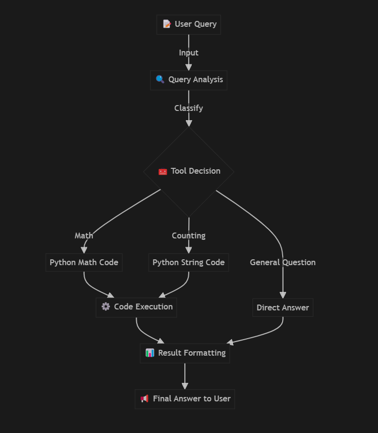

# 🧠 Tool-Using AI Assistant

A powerful AI assistant that leverages Gemini and Python to solve problems by automatically generating and executing code. This system can handle mathematical calculations, character counting, and general questions without requiring the user to write any code.

## ✨ Features

- 🧮 **Automatic Math Calculations** - Solves arithmetic operations and mathematical expressions
- 🔤 **Smart Character Counting** - Counts occurrences of characters in strings
- 🤖 **Self-Deciding Tool Usage** - Intelligently determines when to use Python as a tool
- 💬 **Direct Answers** - Provides answers to general knowledge questions
- ⚠️ **Error Handling** - Robust error management for API and code execution issues

## 🛠️ Setup

1. **Clone this repository**:
   ```
   git clone <repository-url>
   cd <repository-directory>
   ```

2. **Install dependencies**:
   ```
   pip install -r requirements.txt
   ```

3. **Set up your API key**:
   - Create a `.env` file in the root directory
   - Add your Google Gemini API key:
     ```
     GOOGLE_API_KEY=your_api_key_here
     ```
   - You can obtain a Gemini API key from [Google AI Studio](https://ai.google.dev/)

## 🚀 Usage

1. **Run the application**:
   ```
   python app.py
   ```

2. **Ask questions like**:
   - "What is 147 × 29 + 85?"
   - "How many 'l's are in 'yellow balloon'?"
   - "What is the capital of France?"

3. **Exit the application**:
   - Type 'exit', 'quit', or 'bye'

## 🔄 How It Works (Workflow)



**Detailed workflow**:

1. 📝 **User Input**: The user enters a question or problem
   
2. 🔍 **Query Analysis**: The Gemini AI model analyzes the query to determine its type:
   - Math calculation
   - Character counting
   - Direct answer question
   
3. 🧰 **Tool Selection**:
   - For math: Generates appropriate Python calculation code
   - For counting: Generates Python string manipulation code
   - For general questions: Provides direct answers
   
4. ⚙️ **Action Execution**:
   - If code is generated, it's executed in a safe Python environment
   - If it's a direct answer, no execution is needed
   
5. 📊 **Result Formatting**:
   - Math results are formatted as "The result is: X"
   - Counting results show the pattern and occurrences
   - Direct answers are shown as received from the model
   
6. 📢 **Response Delivery**: The formatted answer is presented to the user

## 🧩 System Components

The application consists of two main files:

- **app.py**: Core application logic including:
  - User interaction handling
  - Gemini API integration
  - Query processing
  - Code execution
  - Response formatting

- **error_handler.py**: Error management system with:
  - API error handling
  - Code execution error handling
  - Safe query processing decorator

## 📋 Examples

### Math Calculations
```
Your question: What is 147 × 29 + 85?
Answer: The result is: 4348
```

### Character Counting
```
Your question: How many 'l's are in 'yellow balloon'?
Answer: There are 4 'l' in 'yellow balloon'
```

### Direct Answers
```
Your question: What is the capital of France?
Answer: Paris
```

## ⚠️ Limitations

- Requires an internet connection for the Gemini API
- Complex calculations might be limited by Python's capabilities
- API usage is subject to Google's rate limits and terms of service

## 🔒 Security Notes

This application:
- Runs code in a restricted environment
- Only executes simple calculations and string operations
- Does not have access to file system or network operations
- Cannot import unauthorized modules

## 🤝 Contributing

Contributions are welcome! Please feel free to submit a Pull Request.

## 📜 License

This project is licensed under the MIT License - see the LICENSE file for details. 